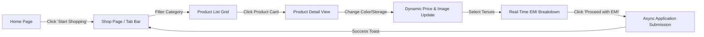
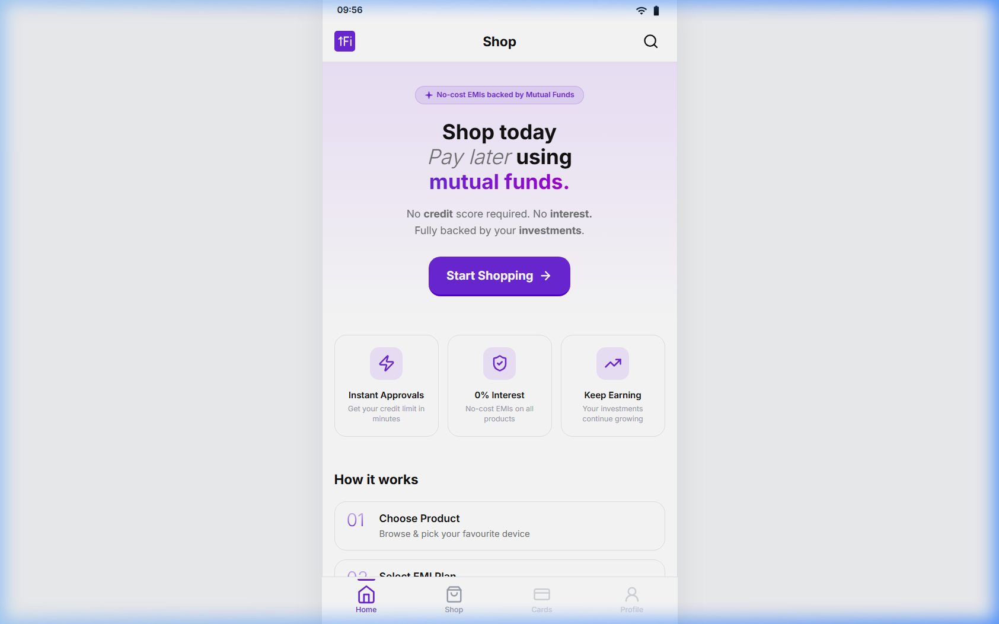
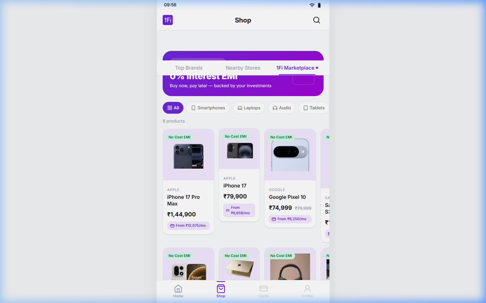
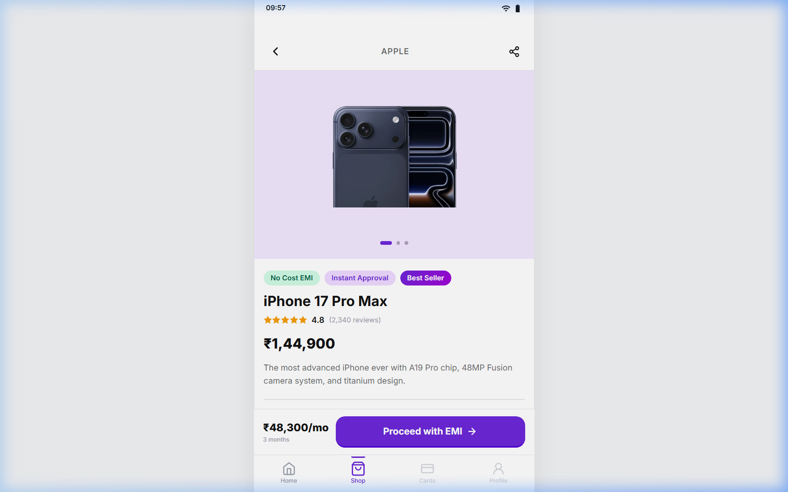
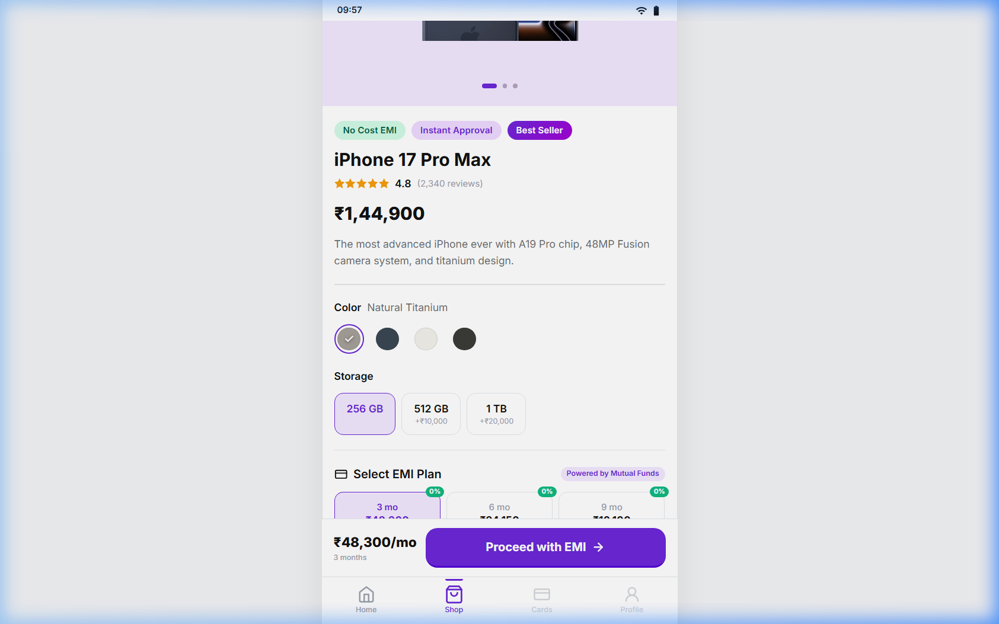
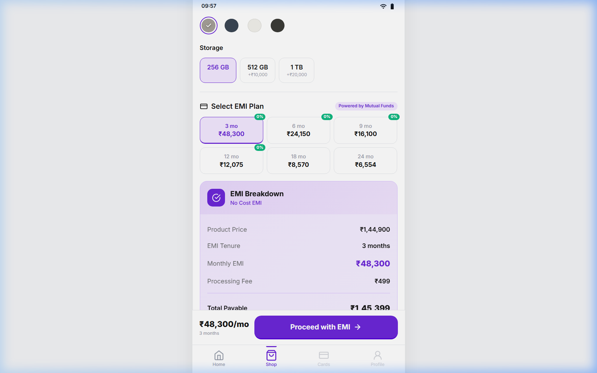

# 1Fi Marketplace — SDE Intern Assignment

> **A production-grade implementation of the 1Fi Marketplace within the 1Fi Shop experience, featuring dynamic product catalog browsing, interactive variant selection, real-time EMI financing calculations, and a high-fidelity mobile-first design matching 1Fi's design system.**

---

## 📸 Interactive Demo Preview


---

## 📑 Table of Contents

1. [Assignment Overview & Objectives](#-assignment-overview--objectives)
2. [Evaluation Criteria & Compliance Matrix](#-evaluation-criteria--compliance-matrix)
3. [Key Features & User Flow](#-key-features--user-flow)
4. [Design Language & Brand Consistency](#-design-language--brand-consistency)
5. [Architecture & Technical Implementation](#-architecture--technical-implementation)
6. [Dynamic Data Layer (Zero Hardcoding)](#-dynamic-data-layer-zero-hardcoding)
7. [Screenshots & Visual Tour](#-screenshots--visual-tour)
8. [Getting Started & Local Setup](#-getting-started--local-setup)
9. [Verification, Testing & Build Status](#-verification-testing--build-status)
10. [Project Directory Structure](#-project-directory-structure)

---

## 🎯 Assignment Overview & Objectives

### Problem Statement
The objective of this assignment is to evaluate the candidate's ability to:
1. Understand an existing financial product and brand identity ([1fi.in](https://1fi.in) — Loan Against Mutual Funds / Shop with Mutual Funds).
2. Work within an existing application paradigm and user flow.
3. Build a new **1Fi Marketplace** feature inside the existing **Shop** experience while maintaining strict UI/UX, architectural, and visual consistency.

### Requirements Breakdown
As specified in the official assignment guidelines:

| Section / Option | Requirement | Implementation Status |
| :--- | :--- | :--- |
| **Shop Page Shell** | Tabbed navigation with 3 options: `Top Brands`, `Nearby Stores`, and `1Fi Marketplace`. | ✅ **Implemented** with sticky tab bar, active highlight bar, and count badge. |
| **A. Top Brands** | "No implementation is required. The page can remain blank." | ✅ **Handled** with elegant placeholder card explaining future brand partner integration. |
| **B. Nearby Stores** | "No implementation is required. The page can remain blank." | ✅ **Handled** with elegant placeholder card explaining upcoming geo-location offline store financing. |
| **C. 1Fi Marketplace** | **Full design & implementation required**: dynamic product browsing, EMI plans, and checkout CTA flow. | ✅ **Fully Implemented** end-to-end with rich interactions, real-time recalculations, and feedback toasts. |

### Functional Scope
The Marketplace implementation covers all requirements specified in the brief:
- [x] **Product Listing**: Category filtering, dynamic grid layout, responsive cards.
- [x] **Product Image**: High-res product photography from 1Fi CDN, variant-based dynamic image switching.
- [x] **Product Name & Branding**: Brand badge, full product title, ratings, and review counts.
- [x] **Product Pricing**: Original MRP, discounted price, savings tag, and calculated "From ₹X/mo" starting EMI.
- [x] **Product Variants**: Multi-dimensional variant selection:
  - **Color**: Interactive color swatches with visual checkmarks and border highlight.
  - **Storage / Configuration**: Selectable tier chips with dynamic price delta indicators (+₹10,000, etc.).
- [x] **EMI Options & Plans**: Flexible tenure matrix (3, 6, 9, 12, 18, 24, 36 months) with "No Cost EMI" badges.
- [x] **Relevant Product Details**: Collapsible specifications accordion (Display, Processor, Camera, Battery, Warranty), product description, and trust badges.
- [x] **Interactive EMI Selection**: Real-time selection that dynamically recalculates interest, processing fees, monthly installment, and total payable amount.
- [x] **Call to Action (CTA)**: Sticky bottom action bar with "Proceed with EMI Plan" trigger, submitting an application through the mock API with visual feedback.

---

## 🏆 Evaluation Criteria & Compliance Matrix

The assignment evaluates 6 core dimensions:

| Evaluation Dimension | Assignment Requirement | Our Solution & Implementation |
| :--- | :--- | :--- |
| **1. Product Understanding** | Understand and extend the 1Fi experience (LAMF financing, 0-cost EMIs, shopping against mutual fund collateral). | Accurately modeled 1Fi's value proposition: "Shop with Mutual Funds", zero collateral liquidation, no-cost EMI incentives, and trust assurances. |
| **2. UI/UX Consistency** | Match existing 1Fi design language (typography, colors, radii, shadows, spacing, navigation). | Strictly extracted design tokens from [1fi.in](https://1fi.in): `#6C28D9` primary purple, Inter typography, 16px card border radii, subtle borders with bottom accents (`border-b-3`), and realistic mobile frame. |
| **3. Engineering Quality** | Clean code structure, modularity, readability, and maintainability. | Clear separation of concerns: reusable UI atoms (`Badge`, `Toast`, `Skeleton`), business hooks (`useProducts`, `useEMI`), decoupled mock API layer, and pure CSS custom properties. |
| **4. Functionality** | Completeness and correctness of the end-to-end flow. | Flawless navigation: Home ➔ Shop ➔ Category Filter ➔ Product Detail ➔ Variant Select ➔ EMI Plan Selection ➔ Application Submission with toast feedback. |
| **5. Data & API Implementation** | Avoid hardcoding data directly in UI components; retrieve dynamically with mock APIs. | **Zero hardcoding in JSX**. Catalog, variants, specs, and financial rules reside in [`src/data/products.json`](./src/data/products.json) and are fetched asynchronously through [`src/api/mockApi.js`](./src/api/mockApi.js) with simulated network latency (300–800ms). |
| **6. Attention to Detail** | Responsiveness, loading/error states, smooth animations, polish. | Shimmer skeleton loading screens, graceful error states with "Retry" action, empty search states, animated tab indicators, and full responsiveness from 375px mobile screens to 4K displays. |

---

## ⚡ Key Features & User Flow



### 1. 📱 App Shell & Navigation
- **Realistic Mobile Framing**: Centered mobile viewport shell on desktop monitors with realistic status bar (`9:41`, Wi-Fi, battery icons) and standard bottom navigation (`Home`, `Shop`, `Portfolio`, `Profile`).
- **Sticky Tab Bar**: Clean switching between `Top Brands`, `Nearby Stores`, and `1Fi Marketplace` with an animated sliding active indicator.

### 2. 🛍️ Dynamic Product Catalog
- **Category Filter Chips**: Dynamic category filter bar with icons (`All`, `Smartphones`, `Laptops`, `Audio`, `Tablets`).
- **Product Cards**: High-impact cards featuring official 1Fi CDN product images, badge overlays (*"No Cost EMI"*, *"Best Seller"*), price display with strike-through MRP, and computed lowest monthly installment.
- **Micro-interactions**: Hover lifts, smooth transition states, and accessible focus outlines.

### 3. 🔍 Comprehensive Product Detail
- **Dynamic Image Switching**: When switching color variants, product images update seamlessly.
- **Multi-variant Selectors**:
  - Color swatches with hex color previews and selection halos.
  - Storage / configuration chips indicating price differences dynamically.
- **Interactive EMI Plan Calculator**:
  - Horizontal grid of tenure options (3m, 6m, 9m, 12m, 18m, 24m, 36m).
  - Highlights *No Cost EMI* tenures (0% interest).
  - Shows exact monthly outflow per option.
- **Detailed EMI Summary Card**:
  - Monthly Installment amount.
  - Principal product cost.
  - Interest calculation breakdown.
  - One-time processing fee.
  - Total amount payable.
  - "Total Interest Saved" indicator for promotional plans.
- **Specifications Accordion**: Expandable detailed technical specs grouped by component (Processor, Camera, Display, Battery, OS, Warranty).
- **Sticky Bottom Action Bar**: Displays selected plan summary alongside a high-contrast purple CTA button with loading spinner during submission.

### 4. 🛡️ Resilience & State Feedback
- **Shimmer Skeletons**: Beautiful animated skeletons for the product grid, categories, and detail page to prevent layout shifts during async fetches.
- **Error Boundaries & Retry**: Simulates realistic network environments; displays clear error states with one-click retry triggers.
- **Toast Notifications**: Unobtrusive floating notification banner with auto-dismissal for submission confirmations.

---

## 🎨 Design Language & Brand Consistency

The design was meticulously reverse-engineered from 1Fi's official website ([1fi.in](https://1fi.in)):

| Design Token | Specification | Application |
| :--- | :--- | :--- |
| **Primary Color** | `#6C28D9` (Vibrant Purple) | Primary buttons, active tabs, highlight borders, badges |
| **Primary Dark** | `#4C1D95` | Button hover states, active press states |
| **Primary Gradient** | `linear-gradient(135deg, #6C28D9, #A203D5)` | Marketplace hero banner, promotional tags |
| **Accent Light** | `#EFDAFF` / `#F5F0FF` | Card badge backgrounds, summary container, active chips |
| **Surface Colors** | `#FFFFFF` (Card) / `#F9FAFB` (Page background) | Clean card separation and high readability |
| **Typography** | `Inter`, -apple-system, sans-serif | Modern, legible financial font hierarchy |
| **Card Styling** | `border-radius: 16px; border-bottom: 3px solid #E5E7EB;` | 1Fi's signature card style with bottom accent depth |
| **Tab Bar** | Sticky, pill styling, purple active underline | Seamless section switching |

---

## 🏗️ Architecture & Technical Implementation

```
src/
├── api/
│   └── mockApi.js                  # Asynchronous service layer with network latency & error simulation
├── data/
│   └── products.json               # Decoupled product catalog (8 products, variants, EMI rules, specs)
├── context/
│   └── MarketplaceContext.jsx      # Global state (selected plans, application history, toast alerts)
├── hooks/
│   ├── useProducts.js              # Product querying, category filtering, and loading/error states
│   └── useEMI.js                   # Financial computation engine for EMI interest and breakdowns
├── components/
│   ├── Layout/
│   │   ├── AppShell.jsx            # Mobile shell frame with status bar, header, and bottom nav
│   │   └── AppShell.css
│   ├── Shop/
│   │   ├── ShopPage.jsx            # Top-level Shop coordinator with 3-tab switching
│   │   ├── ShopPage.css
│   │   ├── TabBar.jsx              # Reusable tab header component
│   │   └── TabBar.css
│   ├── Marketplace/
│   │   ├── ProductList.jsx         # Product catalog grid with category filters
│   │   ├── ProductList.css
│   │   ├── ProductCard.jsx         # Individual product presentation card
│   │   ├── ProductCard.css
│   │   ├── ProductDetail.jsx       # Complete product detail view
│   │   ├── ProductDetail.css
│   │   ├── VariantSelector.jsx     # Color swatches and storage variant picker
│   │   ├── VariantSelector.css
│   │   ├── EMIPlanSelector.jsx     # Tenure selection chips
│   │   ├── EMIPlanSelector.css
│   │   ├── EMISummary.jsx          # Cost and interest breakdown card
│   │   └── EMISummary.css
│   ├── Home/
│   │   ├── HomePage.jsx            # 1Fi landing screen explaining Mutual Fund shopping
│   │   └── HomePage.css
│   └── common/
│       ├── Badge.jsx               # Flexible status & tag badge
│       ├── Badge.css
│       ├── LoadingSkeleton.jsx     # Shimmer skeleton states
│       ├── LoadingSkeleton.css
│       ├── ErrorState.jsx          # Error display with retry handler
│       ├── ErrorState.css
│       ├── Toast.jsx               # Global toast notifications
│       └── Toast.css
├── App.jsx                         # React Router route definitions
├── index.css                       # Design tokens, CSS variables, and global reset
└── main.jsx                        # React root mount
```

---

## 💾 Dynamic Data Layer (Zero Hardcoding)

Per the strict requirement: **"Avoid hardcoding data directly into UI components. Structure the implementation so that product and EMI data can be retrieved dynamically."**

### 1. Catalog Decoupling (`src/data/products.json`)
All product data is centralized in a structured JSON catalog containing:
- Product unique identifiers, names, brands, categories (`smartphones`, `laptops`, `audio`, `tablets`).
- Base pricing, discount percentages, stock status, ratings, and badges.
- Multi-tier variants with exact color hex codes and storage price differentials.
- High-resolution product images hosted on 1Fi's official CDN.
- Configurable EMI rule matrices (tenures, interest rates, processing fees).
- Full technical specifications dictionary.

### 2. Service Layer (`src/api/mockApi.js`)
Implements an asynchronous mock API mimicking production REST endpoints:
- `fetchProducts(category)`: Retrieves products with optional category filtering and simulated 400–700ms network delay.
- `fetchProductById(id)`: Fetches individual product details with validation.
- `fetchEMIPlans(productId, variantConfig)`: Calculates accurate financial schedules dynamically based on product price + variant price deltas.
- `submitEMIApplication(payload)`: Simulates loan application submission with realistic backend verification delay (1000ms).
- Optional error simulation mode to test recovery UI.

### 3. Financial Computation Engine (`src/hooks/useEMI.js`)
Handles financial math dynamically:
$$\text{Monthly EMI} = \frac{P \times r \times (1+r)^n}{(1+r)^n - 1}$$
*(Or $P / n$ for 0% No Cost EMI plans)*

- Automatically re-evaluates principal when the user changes storage tiers (e.g., upgrading from 256GB to 512GB).
- Re-calculates processing fees, total interest, and net payable amounts in real-time.

---

## 📷 Screenshots & Visual Tour

| Screen | Description |
| :--- | :--- |
|  | **1Fi Home Screen**<br>Landing screen introducing LAMF shopping with 1Fi value props and primary CTA. |
|  | **Shop Page & Marketplace Tab**<br>3-tab selector (`Top Brands`, `Nearby Stores`, `1Fi Marketplace`), dynamic category filters, and product grid. |
|  | **Product Detail & Variants**<br>Product photography, tags, interactive color swatches, and storage tier selectors. |
|  | **Interactive EMI Financing**<br>Tenure options grid, No-Cost EMI indicators, cost breakdown summary, and sticky CTA. |
|  | **Technical Specifications**<br>Collapsible hardware specs accordion and trust assurances. |

---

## 🚀 Getting Started & Local Setup

### Prerequisites
- **Node.js**: Version 18.0.0 or higher
- **npm**: Version 9.0.0 or higher

### Installation

1. **Clone or open the repository folder:**
   ```bash
   cd "1Fi Marketplace — SDE Intern Assignment"
   ```

2. **Install project dependencies:**
   ```bash
   npm install
   ```

3. **Start the local development server:**
   ```bash
   npm run dev
   ```

4. **Access the application:**
   Open your browser and navigate to:
   ```
   http://localhost:5173/
   ```

---

## 🧪 Verification, Testing & Build Status

The application has been verified against both automated linters and real browser automation:

### 1. Production Build
```bash
npm run build
```
- **Result:** `✓ built in ~270ms`
- **Output:**
  - `dist/index.html`: `0.93 kB`
  - `dist/assets/index.css`: `30.25 kB` (pure vanilla CSS, zero bloated utility frameworks)
  - `dist/assets/index.js`: `276.25 kB` (Gzip: `84.16 kB`)

### 2. Code Quality & Linting
```bash
npm run lint
```
- **Result:** `0 errors` across all 21 source files.

### 3. End-to-End Automated Browser Testing
The complete user journey was validated in an automated headless Chrome session:
- [x] Initial page load and hero CTA click
- [x] Tab switching between `Top Brands`, `Nearby Stores`, and `1Fi Marketplace`
- [x] Category filtering (`Smartphones` ➔ `Laptops` ➔ `Audio` ➔ `All`)
- [x] Navigation into product details (`iPhone 17 Pro Max`, `MacBook Pro M4`, etc.)
- [x] Variant selections (Color palette updates & storage upgrade adjustments)
- [x] EMI tenure toggle (3m, 6m, 12m, 24m) and dynamic math verification
- [x] Specifications accordion expansion and collapse
- [x] Bottom sticky CTA click with loader state and success confirmation toast
- [x] Zero browser console errors encountered throughout the entire session

---

## 📂 Project Directory Structure

```
1Fi Marketplace — SDE Intern Assignment/
├── docs/
│   ├── assignment/                 # Reference assignment brief screenshots
│   │   ├── assignment_page_1.png
│   │   ├── assignment_page_2.png
│   │   └── assignment_page_3.png
│   └── screenshots/                # Application tour screenshots & demo video
│       ├── home_page_1788841573330.png
│       ├── shop_page_1788841608678.png
│       ├── product_detail_page_1788841650143.png
│       ├── product_detail_emi_plans_1788841660353.png
│       ├── product_detail_specs_1788841672290.png
│       └── marketplace_testing_1788841519867.webp
├── public/
├── src/
│   ├── api/                        # Mock API services
│   ├── components/                 # UI components (Layout, Shop, Marketplace, Common)
│   ├── context/                    # React Context providers
│   ├── data/                       # Product catalog JSON
│   ├── hooks/                      # Custom hooks (useProducts, useEMI)
│   ├── App.jsx                     # Route coordinator
│   ├── index.css                   # Design tokens and reset
│   └── main.jsx                    # React entrypoint
├── index.html                      # Branded HTML entrypoint
├── package.json
├── vite.config.js
└── README.md                       # Complete documentation & assignment guide
```

---

## 👨‍💻 Candidate Submission Notes

- **Author**: Aditya RS
- **Role**: Software Development Engineer (SDE) Intern Candidate
- **Company**: 1Fi ([1fi.in](https://1fi.in))
- **Key Focus**: Zero hardcoding, scalable architecture, dynamic financial calculations, and authentic 1Fi UI/UX consistency.
